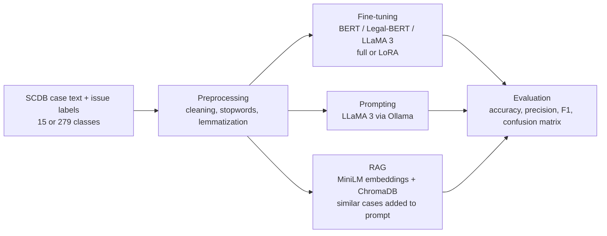

# Supreme Court Case Classification with LLMs

Research notebooks that benchmark fine-tuned encoders, LLM prompting and retrieval-augmented generation for classifying U.S. Supreme Court cases by legal issue.

This is the experiment code behind the paper **"Large-Language Memorization During the Classification of United States Supreme Court Cases"** ([arXiv:2512.13654](https://arxiv.org/abs/2512.13654), DOI [10.48550/arXiv.2512.13654](https://doi.org/10.48550/arXiv.2512.13654)).

## Overview

Supreme Court opinions are long, and the Supreme Court Database (SCDB) issue taxonomy is fine-grained, so assigning each case its legal issue is hard to automate. The project compares several ways of doing it at two levels of granularity: **15 broad issue areas** and **279 specific issues**. The approaches include fine-tuning encoders (BERT, Legal-BERT) with and without LoRA adapters, zero-shot prompting of LLaMA 3 through Ollama, and a RAG pipeline that retrieves similar cases before asking the LLM.

## What's inside

| Approach | Notebooks | Models |
|---|---|---|
| Full fine-tuning (`AutoModelForSequenceClassification`) | `automodel-bert`, `automodel-legalbert`, `automodel_llama3` | `bert-base-uncased`, `nlpaueb/legal-bert-base-uncased`, Meta-Llama-3-8B |
| Parameter-efficient fine-tuning (LoRA, r=16) | `peft-research_BERT_15`, `peft-research-legalbert-15`, `peft_research_BERT_279`, `peft_research_LegalBERT_279` | BERT, Legal-BERT |
| Prompt-based classification | `classify-llama-prompt`, `classify-llama-prompt-15`, `classify-llama-prompts-279`, `classify-llama-279-full` | LLaMA 3 via Ollama |
| Retrieval-augmented classification | `rag-research`, `rag-research_15`, `rag-research_279` | `all-MiniLM-L6-v2` embeddings + ChromaDB + LLaMA 3 |
| Diffusion-regularized classifier (exploratory) | `classification_diffusion_trial` | Frozen BERT + DDPM denoiser + classifier head |
| Evaluation | `compare-results` | Compares LLM labels against ground truth |

`legal_topics_dict.py` maps the 279 SCDB issue codes to their text descriptions and is used by the 279-category prompt and RAG notebooks.

## Tech stack

Python, PyTorch, Hugging Face Transformers, PEFT (LoRA), Datasets, scikit-learn, Ollama (LLaMA 3), Sentence-Transformers, ChromaDB, textacy, spaCy, NLTK, Weights & Biases. Notebooks were run on Kaggle (some on Colab).

## How it works



- **Fine-tuning:** case text is tokenized and fed to a sequence classification head; the PEFT notebooks wrap the model with a LoRA adapter so only a small set of weights is trained. Runs are logged to W&B.
- **Prompting:** each case is sent to a local LLaMA 3 model (Ollama, `AsyncClient` for concurrency) with the list of candidate categories, and the response is parsed into a label.
- **RAG:** cases are embedded with `sentence-transformers/all-MiniLM-L6-v2` and stored in ChromaDB; the nearest labeled cases are retrieved and included as context in the LLaMA 3 prompt.

## Repository structure

```
.
├── automodel-*.ipynb                     # full fine-tuning baselines
├── peft*-*.ipynb                         # LoRA fine-tuning, 15 and 279 classes
├── classify-llama-*.ipynb                # prompt-based LLaMA 3 classification
├── rag-research*.ipynb                   # retrieval-augmented classification
├── classification_diffusion_trial.ipynb  # exploratory diffusion classifier
├── compare-results.ipynb                 # evaluation against ground truth
├── legal_topics_dict.py                  # 279 SCDB issue codes -> descriptions
└── requirements.txt
```

## Getting started

The notebooks were written for Kaggle and read data from `/kaggle/input/...`. The simplest path is to open them on Kaggle with a GPU and attach the dataset below.

**Data:** [labels-web-of-law on Kaggle](https://www.kaggle.com/datasets/dhruvjoshi892/labels-web-of-law/) (`15_labels_data.csv`, `279_labels_data.csv`). Some notebooks also load the Supreme Court corpus directly through `textacy`.

To run locally:

```bash
git clone https://github.com/DJCodesStuff/Spring_2025_project.git
cd Spring_2025_project
python -m venv venv && source venv/bin/activate
pip install -r requirements.txt
pip install jupyter
jupyter notebook
```

Then:

- Download the Kaggle dataset and update the CSV paths in the notebook you want to run.
- For the prompt and RAG notebooks, install [Ollama](https://ollama.com) and run `ollama pull llama3`.
- For fine-tuning notebooks, log in to Weights & Biases (`wandb login`) and, for gated models such as LLaMA 3, set `HF_TOKEN`.

Some notebooks install extra packages inline (for example `chromadb`, `sentence-transformers`, `nltk`, `contractions`) that are not in `requirements.txt`.

## Results

The best result reported in the paper was an **F1 of 0.624**, from prompt-based classification over the full **279 categories**. See the [paper](https://arxiv.org/abs/2512.13654) for the full comparison, which also covers DeepSeek and a log-smoothed loss.

## Author

**Dhruv Joshi** - [GitHub](https://github.com/DJCodesStuff) - [Portfolio](https://djcodesstuff.github.io/)
